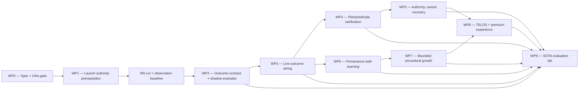

# Ultimate Agent — Convergence, Test, and Rollout Plan

> **Status:** Proposed; implementation is blocked on the recorded Infra/owner gate.
> **Spec:** `docs/superpowers/specs/2026-07-12-ultimate-agent-design.md`
> **Assessment:** `docs/audits/2026-07-12-ultimate-agent-code-truth-assessment.md`
> **Baseline:** nullALIS `c05bcac2`, assessed 2026-07-12

## Goal

Converge nullALIS from a strong agent harness into an evidence-grounded, self-improving, governed,
premium agent without destabilizing launch, replacing the vtable architecture, or activating broad
autonomy as one release.

The program replaces self-reported completion with explicit predicates and evidence receipts first;
then it uses those verified outcomes to govern planning, recovery, learning, TELOS, and premium product
surfaces.

## Sequencing law

The owner chose **launch, then converge**:

1. **Now:** complete code-truth recon, contract, plan, and Infra review. No runtime behavior change.
2. **Current launch waves:** close only approved launch/security prerequisites when their board wave
   opens. Do not pull post-launch agent work into W0–W5.
3. **W5 production cut + observation:** capture the clean production baseline and prove rollback,
   observability, retention, erasure, and cost controls.
4. **Post-launch:** implement the outcome kernel in shadow mode, then promote one capability at a time.
5. **Only after verified outcomes are live:** let procedural learning use them for bounded growth.

This plan does not declare a calendar date for W5. Its post-launch durations begin only after the
zaki-infra board records M5 and the observation baseline is usable.

## Platform gate requested from Infra

Before WP1 or WP2 source work, `opus-infra` or `fable-infra` records exactly one verdict in
`zaki-infra/docs/COORDINATION.md`:

- **GREEN LIGHT** — wave placement, rollout, observability, and rollback are sufficient;
- **GREEN LIGHT WITH CONDITIONS** — list binding conditions and owners; or
- **BLOCKED** — name the conflicting wave/dependency and the event that unblocks it.

The review must answer:

1. Which WP1 findings are launch blockers and where do they fit in W1–W3?
2. Is WP2 correctly held until W5 + baseline observation?
3. What tenant/cohort mechanism will implement 5% and 25% canaries?
4. Where will outcome, predicate, cancellation, learning-promotion, and rollback telemetry live?
5. What storage/retention budget applies to evidence receipts and learning transition ledgers?
6. What deploy rollback and schema roll-forward path is required before PG migrations?
7. Who owns the cross-repo BFF/FE contract and premium UAT?

## Program shape



### Effort envelope

| Work package | Earliest window | Estimated focused effort | Production behavior |
|---|---|---:|---|
| WP0 Spec + gate | Now | 2–3 days | None |
| WP1 Launch prerequisites | Assigned launch wave only | 2–4 weeks across separate security findings | Existing behavior hardened |
| WP2 Outcome contract | Post-W5 observation baseline | 4–6 days | Shadow only |
| WP3 Live outcome wiring | After WP2 | 7–10 days | Observer-only; product canary waits on WP5.2 + WP9 foundation |
| WP4 Plan/predicate verification | After WP3 | 10–15 days | Tool families promoted separately |
| WP5 Authority/cancel/recovery | After WP4; subparts may parallelize | 10–15 days | Controls promoted separately |
| WP6 Provenance-safe learning | After WP3 | 10–15 days | Shadow first; migrations |
| WP7 Bounded procedural growth | After WP6 + WP4 evidence | 10–15 days | Per-user R0/R1 only |
| WP8 TELOS + premium surfaces | After WP5 + WP7 | 10–15 days cross-repo | Human-gated activation |
| WP9 Evaluation lab | Starts with WP2, then continuous | 15–25 days initial; ongoing | Release authority |

With four continuously staffed engine, product, evaluation, and Infra lanes, **engineering-complete**
is an optimistic **8–12 work weeks after launch**. Canary-complete is traffic- and gate-dependent.
Evidence-complete Ultimate Agent V1 includes the longitudinal window and is realistically **12–20+
calendar weeks after the W5 baseline**, including at least 30 days of longitudinal evidence. Quality
gates—not the estimate—control promotion.

The WP9 evaluation-integrity and trusted-outcome foundation must be operational before WP3's first 5%
product canary; later WP9 suites continue in parallel.

## Change discipline for every work package

Every work package is a new coordination claim, branch, and worktree. Do not implement this program on
the planning branch.

1. Pull the current board and claim the exact package.
2. Branch from current `origin/main` into `codex/<bounded-task>`.
3. Re-run recon and `git log --follow -- <target>`; line numbers in this plan are snapshot evidence,
   not implementation truth.
4. Write the failing executable-contract/unit test and observe RED.
5. Implement the smallest contract-preserving change.
6. Review the diff, including security/privacy/resource impact.
7. Run focused, default, canonical all-engine, and live-drive gates as applicable.
8. Obtain spec and quality review; use a whole-branch review before merge.
9. Record activation tier and latent-value audit.
10. Push, request review, deploy only to the authorized stage, and record proof on the board.

High-risk paths (`src/security/**`, `src/gateway.zig`, `src/tools/**`, config, vtables, secret state) need
explicit owner approval before edits, as required by `AGENTS.md`.

---

## WP0 — Lock the contract and platform gate

**Behavioral effect:** none.
**Owner now:** `codex-nullalis-ultimate`; review by `nova` + Infra.

### Deliverables

- [x] Code-truth assessment at `c05bcac2`.
- [x] Binding design with outcome, evidence, learning, authority, SOTA, and premium contracts.
- [x] Phased implementation/test/rollout plan.
- [x] Independent plan checker returns PASS after findings are resolved.
- [x] Adversarial safety/architecture reviewer returns no unresolved P0/P1.
- [x] Independent SOTA/premium evaluator returns PASS after measurement gaps are resolved.
- [x] nullALIS branch pushed; zaki-infra coordination link is the next handoff action.
- [ ] Infra records GREEN LIGHT / GREEN LIGHT WITH CONDITIONS / BLOCKED.
- [ ] Owner accepts, amends, or rejects the authority matrix and autonomous promotion thresholds.

### Exit gate

WP0 is complete only when the documents are reviewable from a pushed branch and the coordination board
contains the explicit Infra verdict. A green planning review authorizes the next package only; it does
not authorize the full program.

---

## WP1 — Close launch authority and secret prerequisites

**Window:** only when Infra assigns each item to an open W1–W3 lane; any mandatory item not closed by
W4 blocks W5 rather than moving post-cut.
**Risk:** high.
**Purpose:** do not place post-launch autonomy on permissive entitlement, fragmented approval, secret,
logging, or platform containment paths.

This package is a program label, not one PR. Each finding below is a separate claim and atomic commit/
PR with its own owner approval.

### WP1.1 — Entitlement continuity

**Recon files:** `src/gateway.zig`, `src/session.zig`, `src/tools/root.zig`, `src/entitlement.zig`,
`src/daemon.zig`.

- [ ] RED: a resolved free/inactive entitlement reaches tool preflight and blocks the right action.
- [ ] RED: an approved pending tool is rechecked after entitlement or policy changes.
- [ ] Thread the immutable per-turn entitlement/capability envelope gateway → session → agent/tool turn
  context; remove permissive fallback on authenticated product paths.
- [ ] Recheck policy, entitlement, scope, and expiry immediately before actual execution. Approval
  bypasses only the already-satisfied confirmation question, not current authorization.
- [ ] Exercise direct chat, approved-pending, scheduler, and subagent lanes.

**Exit:** zero authenticated lane can acquire default pro/full authority because context was absent.

### WP1.2 — One secret mutation contract

**Recon files:** `src/gateway.zig`, `src/gateway/secret_vault.zig`, `src/zaki_state.zig`, config and
operator docs.

- [ ] RED: malformed secret values do not consume confirmation tokens.
- [ ] RED: channel/provider/Telegram mutation cannot bypass the common handshake.
- [ ] RED: audit persistence failure fails the mutation or enters a deterministic recoverable state.
- [ ] Validate → prepare/confirm → commit → required audit; use one helper for every route.
- [ ] Bound outstanding tokens per user/key/action and expire deterministically.
- [ ] Fail closed if the master key is absent; align code and docs on one environment key.
- [ ] Preserve rollback for partially created provider/channel records.

**Exit:** every secret write/delete has the same two-phase and audit semantics.

### WP1.3 — Credential and telemetry hygiene

- [ ] Rotate the credential-shaped value in `.spike/benchmark.json`; remove it from the working tree and
  inject secrets only through the test/deploy secret plane. Assess history remediation.
- [ ] Redact raw memory queries and tool argument/output previews from ordinary logs and events; retain
  protected trace access under explicit scope/retention.
- [ ] Add secret-pattern and sensitive-event regression tests.
- [ ] Coordinate, do not duplicate, platform H7–H10: GDPR erasure, egress SSRF containment, metering
  backstop, and production observability.

### WP1.4 — Decide and enforce the launch authority posture

The current `.full` default auto-approves every tool metadata class, including `operator_only`. This
cannot be treated as a harmless implementation detail.

- [ ] Owner chooses the launch posture for web, channels, scheduler, and standalone CLI separately.
- [ ] RED: R2/R3/R4U/R4O representative tools cannot execute on a generic `.full` label without their
  required scoped/fresh human authority.
- [ ] Prefer capability/risk enforcement over renaming modes; preserve autonomous R0 and explicitly
  requested reversible R1 behavior to avoid confirmation fatigue.
- [ ] Show the effective posture to the user/operator, including which source set it.
- [ ] Test channel, API, scheduled, resumed, approved-pending, and subagent lanes.

**Exit (mandatory before W5):** no product ingress can turn a blanket mode into automatic
R2/R3/R4U/R4O authority. Infra/owner chooses where and how to enforce the gates; if enforcement cannot
land before cut, those action classes are disabled at every ingress. The invariant is not waivable or
deferrable post-cut.

### WP1 validation

```bash
zig build test --summary all
zig build test --summary all \
  -Dengines=base,sqlite,postgres \
  -Dchannels=cli,telegram
NULLALIS_POSTGRES_TEST_URL=postgres://<test-user>@localhost:5432/postgres \
  zig build test-postgres --summary all \
  -Dengines=base,sqlite,postgres \
  -Dchannels=cli,telegram
zig build -Doptimize=ReleaseSmall \
  -Dengines=base,sqlite,postgres \
  -Dchannels=cli,telegram
```

Live staging drives: revoked entitlement after approval, invalid-then-valid secret confirmation,
channel/provider secret rotation, telemetry inspection, and erasure residue check.

---

## W5 + observation baseline — Stop before behavioral change

After production cut:

- [ ] Observe the promoted clean SHA for the board's required period.
- [ ] Record task success, error, tool, cancel, approval, entitlement, latency, cost, memory, and
  extraction baselines without changing user-visible behavior.
- [ ] Verify PG snapshot/PITR, image rollback, schema roll-forward, NFS backup, trace retention, GDPR
  erasure, log aggregation, and synthetic journey.
- [ ] Pin the model/provider/config/tool catalog used by the baseline.
- [ ] Run cold + polluted spike, LoCoMo, and τ-bench baselines and append profile-qualified results.
- [ ] Publish a baseline report ID consumed by every later `CapabilityPromotionRecord`.

**Stop condition:** do not begin WP2 if production cannot be observed or rolled back reliably.

---

## WP2 — Add the outcome contract and shadow evaluator

**Branch suggestion:** `codex/outcome-contract`
**Risk:** medium until wired; contract-critical.
**Production stage:** shadow only.

### Files

Create:

- `docs/outcome-contract.md`
- `src/agent/outcome.zig`
- `src/agent/outcome_contract_test.zig`

Modify the narrow host import (expected `src/agent/root.zig`) so the contract test runs under both
default and all-engine profiles. Do not yet change gateway product semantics.

### Tasks

- [ ] RED: encode UA-01 through UA-03 and the pure disposition/attainment/effect, receipt-supersession,
  and precondition semantics as evaluator tests.
- [ ] Implement `GoalContract`, finite `PredicateCheck`, distinct `ExecutionPrecondition`, keyed
  `EvidenceReceipt`, `EffectReceipt`, `OutcomeStatus`, `TerminalCause`, and deterministic evaluator.
- [ ] Implement pure `GoalContractBuilder`/versioning: test fixtures create identity, a structurally
  typed but not-yet-enforced `AuthorityEnvelope`, budget, and host-compiled predicates; objective/scope
  changes create a new linked version.
- [ ] Test that model proposals cannot delete, weaken, or replace required predicates.
- [ ] RED: model-selected `tool_succeeded`, verifier identity, or expected digest cannot replace the
  host registry's minimum readback recipe or use post-result data as its expected value.
- [ ] Reject cross-goal, cross-run, wrong-tool, wrong-user/tenant, duplicate, and unknown-verifier
  receipts.
- [ ] Implement final/provisional receipt state, valid same-contract retry supersession, conflict
  detection, and mandatory effect disclosure; empty predicate sets evaluate `unverified` before the
  all-passed rule.
- [ ] Implement ordered effect transition chains with receipt ID, sequence, previous link, timestamp,
  legal prepared→applied/unknown→verified/reverted transitions, per-effect reduction before aggregate
  folding, and `effect_conflict` handling. Test crash/retry/revert replay.
- [ ] Implement the spec's total disposition × evidence truth table, including `not_applicable` for
  `goal_id=null`, unresolved provider/tool error, max-iteration/budget exhaustion, and cancellation
  before the first predicate resolves.
- [ ] Add per-tenant keyed-HMAC/omission/redaction helpers with key-rotation and fixed vectors; never
  persist a plain digest for low-entropy personal or secret values.
- [ ] Add a bounded in-memory receipt accumulator; prove deinit and OOM paths at zero leaks.
- [ ] Add an evaluator fixture/replay reporter that compares legacy/model goal status with the host
  outcome status without attaching to production execution yet.
- [ ] Measure evaluation latency, allocations, receipt bytes, and disagreement rate.

### Tests

- Model says `met`; tool fails → terminated + attainment `failed`.
- No goal contract on an ordinary conversational reply → attainment `not_applicable` and no completion
  badge.
- No goal contract plus mutation/external/child/effect → `contract_missing`, unverified, effects
  disclosed; never `not_applicable`.
- No predicates → attainment `unverified` (never vacuous success).
- Required mutation succeeds; readback mismatches → failed attainment + applied effect.
- All required checks pass → terminated + `succeeded` + verified effect.
- User-only check pending → disposition `awaiting_user` + attainment `pending`.
- Child pending → running + pending.
- Cancellation → disposition `cancelled`, independent attainment, every effect listed.
- Policy/entitlement precondition fails → disposition `blocked`, never predicate success/failure.
- Provider error, max-iteration/budget exhaustion, and cancellation before any predicate resolves map
  to the exact pending/unverified rows in the total table.
- Some passes + terminal unresolved/failure → attainment `partial`.
- Optional failure does not defeat satisfied required predicates.
- Forged/misbound receipt is rejected.
- Failed attempt followed by valid superseding success uses the later final receipt but retains both
  attempts/effects; conflicting finals without supersession yield `evidence_conflict` + unverified.
- Prepared → applied_unverified → verified/reverted effect chains replay deterministically; forked
  transitions yield `effect_conflict` + reconciliation state, never accidental `mixed` success or a
  Completed headline. Required-evidence conflict overrides passing receipts; optional conflict does not
  alter required attainment.

### Offline verification and exit

Replay bounded captured/synthetic fixtures for successful action/readback, impossible digest,
child-pending, cancellation, and forged receipts. WP2 does not yet claim a real-binary live drive;
runtime receipt production belongs to WP3 and tool-specific readback to WP4. Exit when pure contract
tests pass under default/all-engine profiles, the evaluator is deterministic and leak-free, projected
receipt overhead is inside its measured budget, and an independent contract review passes.

---

## WP3 — Carry structured outcomes through the real product path

**Branch suggestion:** `codex/outcome-wiring`
**Depends on:** WP2.
**Risk:** high (`gateway`, session compatibility, procedural learning).
**Rollout:** observer-only; 5% product canary only after WP5.2 and the WP9 foundation pass.

### Files to recon at implementation HEAD

- `src/agent/root.zig`
- `src/agent/dispatcher.zig`
- `src/session.zig`
- `src/gateway.zig`
- `src/gateway_run_events.zig`
- `src/observability.zig`
- `src/agent/run_event_types.zig`
- `src/agent/goal_loop.zig`
- `src/agent/procedural_memory.zig`

### Tasks

- [ ] RED: production return sites populate executed-call receipts for serial and parallel dispatch.
- [ ] Bind each result by `tool_use_id`; preserve expected tool identity and run lineage.
- [ ] Create the base goal contract at request ingress and carry it through session, agent, child,
  trace, and gateway boundaries.
- [ ] Preserve `TurnOutcome.tool_calls_executed: []const []const u8` for compatibility and add a new
  `tool_call_receipts` field alongside outcome status, cause, predicate results, evidence/effect
  receipts, and pending approval; preserve ownership/deinit semantics.
- [ ] Add `processMessageOutcomeWithContext`; retain the text API as a wrapper.
- [ ] Make the gateway consume the outcome directly; delete the empty-reply tool-only heuristic only
  after the structured path is live and covered.
- [ ] Persist keyed/omitted, retention-classed outcome/receipt data in the existing encrypted trace
  plane before proposing a new table.
- [ ] After a current zaki-prod recon, define the minimal versioned outcome-v1 protocol
  (`schema_version`, run/goal IDs, disposition, attainment, effect state, terminal cause, proof/effect
  availability/counts) across engine →
  BFF → an internal/test frontend renderer; old clients continue to receive text. WP8 expands this
  protocol additively for approvals, growth, and premium interactions.
- [ ] Downgrade model goal reflection to advisory continuation/recovery input. It cannot mark met or
  set procedural quality.
- [ ] Correct/remove the current reflection producer/parser mismatch as part of that same contract.
- [ ] On max iteration, loop detection, provider error, or tool error, set an explicit terminal cause.
- [ ] Derive procedural quality from verified outcome only; `unverified` does not become positive
  training evidence.

### Required live drives

1. A neutral read-only tool with no WP4 verification recipe populates a bound tool-call activity
   receipt but remains terminated + unverified; receipt survives restart/retrieval. This tests wiring,
   not a premature production recipe.
2. Scripted failed action plus optimistic model prose → failed attainment and effect state agree.
3. Empty direct response, no tools → not fabricated tool-only success.
4. Spawned child pending → parent running + pending; child completion closes it later.
5. Provider/tool failure → honest disposition/attainment/effect cause and recovery action.

### Promotion gates

- **Observer-only:** gateway computes and records disagreement; UI remains unchanged.
- **5%:** only after propagated cancellation (WP5.2), frozen-registry trusted-outcome evaluation and
  integrity controls (WP9.1/foundation), and the minimal protocol pass; an internal/test tenant renders
  outcome state and old clients are validated.
- **25%:** no false-success, event-loss, ownership/leak, or latency regression.
- **Active:** structured outcome is authoritative for product state. Legacy heuristics are removed in a
  later cleanup commit only after telemetry proves no caller remains.

---

## WP4 — Bind plans and tool families to success predicates

**Branch family:** one per bounded tool family; do not edit every tool in one PR.
**Depends on:** WP3.
**Risk:** medium/high by tool.

### WP4.1 — Correct plan semantics

**Recon:** `src/agent/task_planner.zig`, `src/agent/root.zig`, plan persistence/rendering.

- [ ] RED: wrong successful tool cannot complete a step.
- [ ] RED: mixed failed/done steps cannot produce `completed`.
- [ ] Add stable `step_id` and `predicate_ids`.
- [ ] Bind calls/results by `tool_use_id` + expected tool identity, never position.
- [ ] Distinguish terminal step state from successful step state.
- [ ] Advance within the same turn only after required step predicates pass.
- [ ] Remove prose-only objective step completion.

### WP4.2 — Verification recipe registry

Keep the finite predicate vocabulary in `src/agent/outcome.zig`; place tool-specific recipes beside
`DEFAULT_TOOL_METADATA` or in a single adjacent registry.

For each tool, record:

- risk class and existing cost/approval metadata;
- whether action success is enough or readback is required;
- the designated readback tool and canonical matcher;
- reversibility/idempotency semantics;
- sensitive fields to omit or protect with per-tenant keyed HMAC/encryption and retention class;
- terminal causes and recovery action.

Missing recipes make objective completion `unverified`; they never default to success.

Before dispatch, the host compiles the selected recipe against the exact canonical tool arguments and
freezes that contract version. Model attempts to remove/weaken a failed or pending predicate are
ignored and recorded; a genuine user objective change creates a new linked goal-contract version.
The registry's minimum postconditions are derived from authenticated user intent/approved scope and
tool semantics before the result is observed. R1–R3 mutation cannot downgrade an available independent
readback/external acknowledgement to `tool_succeeded`; approval/policy are preconditions only.

### WP4.3 — Promote tool families independently

| Batch | Initial tools/surfaces | Default stage requirement |
|---|---|---|
| A — tenant-local reversible | file write/edit, artifact create/export | Pre-image or atomic temp+rename, digest readback, undo receipt |
| B — memory and plans | memory store/edit/archive/forget, task/cron state | Readback by key/version/state; retention and erasure tests |
| C — subagents | spawn/delegate/batch | Recipe/status shadow only until WP5.1 enforces equal-or-narrower child authority/budget |
| D — external integrations | send/post/calendar/channel/composio | Recipe/design + shadow only until WP5.1 exact grants and WP5.3 idempotency/journal/recovery pass |
| E — credentials/destructive | secret, permissions, delete/purge | Recipe/design + shadow only until WP5.1 exact grants and WP5.3 before/after audit/recovery pass |

Every batch gets its own promotion record. WP4 may design/test C/D/E recipes, but C cannot promote
before WP5.1 child-envelope enforcement, and D/E cannot promote to effectful production before WP5.1
and WP5.3. Batches D/E never use autonomous learned-procedure promotion even after their base recipes
are live.

Batch A owns the first independent-readback live drives: file mutation + matching host digest →
terminated/succeeded/verified effect; impossible pre-frozen digest → failed attainment + applied effect
despite optimistic prose. The receipts must survive restart/retrieval.

### Exit

The core regression suite passes; each promoted A/B tool has a real binary live drive; C/D/E remain
shadow-only until their WP5 gates; unsupported tools remain honestly unverified; τ-bench/τ²-bench and
existing tool-selection performance do not regress.

---

## WP5 — Close authority, cancellation, idempotency, and recovery

**Depends on:** WP4 recipe/plan substrate, not D/E promotion; subparts are separate branches. WP5.2
may start after WP2/WP3 observer wiring and **must pass before WP3's first product canary**. D/E
promotion resumes only after WP5.1 + WP5.3.
**Risk:** high.

### WP5.1 — Capability envelope and approval revalidation

- [ ] Take WP2's inert typed envelope and enforce one immutable `AuthorityEnvelope` per goal/child
  containing tenant, user, execution
  mode, permitted tools/scopes, risk ceiling, cost/time/action budgets, approval grants, and expiry.
- [ ] Children inherit an equal-or-narrower envelope; attempts to widen it fail explicitly.
- [ ] Implement the spec's exact `ApprovalGrant`, bound to authenticated actor, goal/contract version,
  tool, canonical argument/effect digests and constraints, risk, maximum uses, expiry, policy/
  entitlement versions. A plan approval is a finite R2 grant; R3 is action-specific and
  `maximum_uses=1`.
- [ ] Implement atomic append-only `GrantUseReceipt` reservation/consume/release/invalidate transitions
  with unique per-use nonce/idempotency key. Reserve a valid use and register action start in one
  transaction/synchronization boundary; derive use count from the ledger, never a mutable counter.
- [ ] RED: two parallel workers race for the final grant use and only one registers; crash/restart
  reconciles the same reservation without double-consumption.
- [ ] RED: approve canonical action A, then substitute recipient/content/arguments B → execution denied
  and the old grant remains unconsumed/invalid for B.
- [ ] Enforce separate R4U user-sovereign and R4O operator-governance principals.
- [ ] Revalidate envelope/policy/entitlement at execution and after resume/restart.
- [ ] Emit proof without raw secrets or sensitive content.

### WP5.2 — Propagated cancellation

- [ ] RED: deterministic cancellation races serial/parallel dispatch and child start; no action
  registers after cancellation acknowledgement.
- [ ] Replace the resettable agent-wide token with a run-scoped cancellation epoch and atomic
  action-start gate. Cancellation closes the gate under the same synchronization boundary used to
  register action start, then acknowledges.
- [ ] Check the run token before/after provider calls, before every dispatch, between serial calls,
  before child spawn, and before retry; polling supplements but does not replace the atomic start gate.
- [ ] Thread the run-scoped cancellation view through existing request/turn/tool contexts with minimal
  vtable churn; add a vtable member only after recon proves no smaller contract works.
- [ ] Bound or interrupt provider HTTP requests and child/tool processes where supported.
- [ ] Mark non-cancellable sections explicitly and cap their duration.
- [ ] Parent cancellation propagates to children; child results record cancellation separately.
- [ ] Gateway cancel acknowledgement and terminal outcome agree.

### WP5.3 — Idempotency and recovery

- [ ] Assign an idempotency key to every R2/R3 external action and retry.
- [ ] Add action journal states: prepared → executing → applied → verified or failed/rolled_back.
- [ ] Make tenant-local file mutation atomic with pre-image/keyed-digest recovery.
- [ ] Ensure restart reconciliation cannot duplicate external effects.
- [ ] Add recovery recipes: retry same step, compensate/revert, request scope, or stop.
- [ ] A recovery attempt cannot widen the original goal or authority envelope.

### Live failure injection

- Cancel during provider response, between serial calls, during child fan-out, and during retry.
- Deterministically interleave cancel-gate close and action-start registration across parallel workers
  and child fan-out.
- Race parallel workers and restart reconciliation for one remaining approval use; assert one atomic
  reservation/action-start registration.
- Kill process after external prepare and after action but before receipt persistence.
- Revoke entitlement/approval mid-run.
- Simulate readback outage, duplicate delivery response, partial file write, and stale child result.

### Exit

Zero post-cancel registrations/starts, zero duplicate effects, deterministic restart reconciliation,
tested rollback, exact approval binding, and no authority widening in unit/integration/live staging
suites. Only then may WP4 C/D/E leave shadow under their respective WP5.1/WP5.3 gates.

---

## WP6 — Make memory and learning provenance-safe

**Branch suggestion:** `codex/learning-provenance` plus separate migration PRs.
**Depends on:** WP3 outcome receipts.
**Risk:** high; PG/state/memory/contract governed.

### WP6.1 — Close source laundering

**Recon:** `src/agent/root.zig`, extraction transcript builders, `src/agent/extraction/runner.zig`,
`src/agent/extraction/schema.zig`, prompts, persistence, memory loader.

- [ ] RED: assistant, tool, reflection, system, web, dream, and fleet content cannot persist with
  `source_authority=confirmed_user`; original observed role is never rewritten, and quoted/forwarded
  content inside a user container remains non-endorsed segment data.
- [ ] Preserve immutable observed role/source at ingress even if prompt projection uses another role.
- [ ] Segment authenticated user ingress into authored/quoted/forwarded/attachment/code/generated/
  unknown spans with endorsement state and authority-decision receipt; carry span, message/run/tool IDs,
  origin, derivation parents, classifier version, and policy version.
- [ ] A model classifier may route candidates only; it cannot confer direct-user authority. Quoted,
  forwarded, code-block, attachment, generated, and unknown spans fail closed until exact user adoption.
- [ ] Protect content equality with per-tenant keyed HMAC and key ID or omit it for low-entropy personal/
  secret values; encrypt raw evidence under retention and key-rotation policy.
- [ ] Replace “extract liberally when in doubt” with typed candidate behavior: uncertain claims stay
  untrusted/shadow.
- [ ] Backfill legacy rows as `unknown_legacy`, never assumed user-authored.

### WP6.2 — Decouple learning organs

- [ ] RED: disabling semantic summary does not silently disable unrelated session-end extraction,
  entity enqueue, promotion, or procedural capture.
- [ ] Give each operation its own explicit prerequisite and observable result: ran, nothing to do,
  disabled by policy, or failed.
- [ ] Preserve current launch defaults until separate activation decisions are approved.

### WP6.3 — Transition ledger

- [ ] Extend `docs/learning-contract.md` and executable test in the same commit.
- [ ] Add append-only transition records and latest-state cache; preserve stub parity.
- [ ] Enforce legal transitions, TTL, quarantine, retirement, deletion, derivation invalidation, and
  deterministic replay.
- [ ] Evidence expiry/erasure demotes dependent artifacts; delete derived personal inferences unless
  independently re-established from permitted evidence. Test tenant-key cryptographic erasure.
- [ ] Replace content-overwriting adoption/dismissal with versioned transitions.
- [ ] Link procedural evidence to host outcome receipts, never model goal status.

### WP6.4 — Strict direct correction

- [ ] Replace broad substring triggers with high-precision host rules plus candidate routing that
  distinguishes quote, forward, code, negation, question, hypothetical, assistant address, and
  explicit first-person correction.
- [ ] Only a non-quoted/non-forwarded segment accepted by the host rule or an exact authenticated user
  adoption may become active in low-impact scope. A model classification alone stays proposal/shadow;
  ambiguous/high-impact cases require confirmation.
- [ ] Contradictory active behavior is suppressed immediately and remains suppressed next turn.

### Validation

- Default + canonical + live-PG tests with zero leaks.
- Poisoning corpus including quoted instructions, forwarded email, tool output, web prompt injection,
  dream synthesis, assistant reflection, and cross-tenant IDs.
- Segment-authority suite proves quoted/forwarded/code/attachment spans cannot be activated by a model
  label; low-entropy dictionary attacks cannot match persisted plain digests because none exist.
- Migration from representative legacy rows; restart and deterministic replay.
- Cold + polluted memory benchmarks; no Cat1/Cat2/Cat3 regression.
- GDPR erase traverses artifact derivations and leaves no personal residue.

---

## WP7 — Activate bounded procedural growth

**Depends on:** WP4 verified tool outcomes + WP6 transition ledger.
**Production scope:** per-user R0/R1 only.
**Risk:** medium with hard safety gates.

### Tasks

- [ ] Mine procedure candidates only from linked host-verified outcomes; preserve negative and failed
  examples.
- [ ] Fingerprint goals and deduplicate semantically equivalent candidates.
- [ ] Build deterministic replay/held-out evaluation with a no-learning control.
- [ ] Implement §5.4 gates exactly: the 10-success/30-case numbers are minimum floors, followed by a
  preregistered paired power calculation or approved sequential test, 95% uncertainty bounds,
  non-inferiority margins, value threshold, deterministic zero-incident suite, capability manifest,
  and rollback predecessor.
- [ ] Run candidate in shadow without prompt/action influence; record counterfactual selection.
- [ ] Define canary units as eligible goal-contract opportunities; assign deterministically by user,
  capability, and goal fingerprint; retain a concurrent no-learning control and keep each goal in one
  arm. Canary at 5% then 25%; require both the minimum 10 new verified uses and the preregistered
  powered/sequential promotion predicate per stage.
- [ ] Auto-retire on one critical incident, one authority violation/user stop, or two required failures
  in the trailing 10 uses.
- [ ] After activation, retain a control or periodic pinned replay and continue the preregistered
  sequential non-inferiority monitor. Attribute failures to the procedure before counting provider/
  tool outages; missing/stale promotion telemetry suspends the procedure fail-closed. The trailing-ten
  rule is an emergency tripwire, not the only monitor.
- [ ] Cap active prompt injection to 8 procedures / 2 KiB and measure context displacement.
- [ ] Add user explain/disable/retire/export/delete APIs before 25% canary.
- [ ] Fleet mining emits privacy-bounded aggregates/proposals only; fleet default remains operator
  gated and no raw/dictionary-testable digest crosses tenants.
- [ ] Generated executable skills remain human code-review gated.

### Required A/B evaluation

For every procedure version compare learned vs no-learning under the same pinned model/config:

- verified task success and false-success;
- ask/confirm/refuse/stop/recover behavior;
- tool count, tokens, latency, and cost;
- safety, approval, privacy, and cancellation;
- user override/regret and correction latency;
- distribution-shift and polluted-memory cases.

Preregister the primary endpoint, task-family weights, effect/non-inferiority margins, sample or
sequential stopping rule, and release holdout before results are examined. Report 95% uncertainty
intervals. Underpowered evidence leaves the candidate in shadow or requires explicit per-user adoption;
it never auto-promotes.

### Exit

At least three representative R0/R1 procedure families complete shadow → 5% → 25% → per-user active
with measurable value and a demonstrated automatic rollback. No R2/R3/R4U/R4O behavior is
auto-promoted.

Once the bounded-growth engine itself is human-approved and active, individual qualifying per-user
R0/R1 procedures may promote automatically under the locked contract. This is the intended autonomous
learning behavior; it does not require a human click per procedure.

---

## WP8 — Human-authored TELOS and the premium product surface

**Depends on:** WP5 authority/recovery + WP7 governed growth.
**Repos:** nullALIS, zaki-prod, zaki-infra.
**Risk:** high for TELOS authority; medium for UI.

Before frontend work, run a current zaki-prod code-truth pass and create a dedicated UI specification.
Do not treat this engine plan as pixel truth.

### WP8.1 — TELOS Slice 2

- [ ] Implement propose → before/after preview → authenticated approve/reject → versioned file/state
  transition for T4.
- [ ] Make `telosBackfill` operator-reachable for maintenance under R4O authorization and audit; only
  the authenticated user can approve R4U identity/TELOS content.
- [ ] Implement freshness/retrieval-gated demotion and deterministic recovery.
- [ ] Persist atomically and test restart, conflict, rollback, and erasure.
- [ ] Flip `telos_in_prompt` only for a user/tenant that explicitly accepts the behavior and after the
  contract/bench gates pass.

### WP8.2 — Expand the versioned product protocol

- [ ] Extend WP3's minimal outcome-v1 engine → BFF → FE schema additively with plan step, approval,
  progress, detailed evidence, cancellation, recovery, growth, and TELOS state.
- [ ] Preserve old-client fallback during rollout; remove only after measured adoption.
- [ ] BFF verifies auth/tenant and never synthesizes stronger disposition, attainment, or effect state
  than the engine.
- [ ] Metering binds to the same run and actual action receipts.

### WP8.3 — Premium interaction

- [ ] Stable run card: intent, live steps, exact state, concise outcome.
- [ ] Approval card: action, target, scope, data leaving, reversibility, cost, expiry; approve/edit/deny.
- [ ] Proof drawer: human-readable predicates first, technical receipt detail on demand.
- [ ] Cancellation: immediate acknowledgement, frozen new work, every prepared/applied/unknown effect
  named.
- [ ] Recovery: retry failed step, narrow/edit scope, approve, revert, or stop.
- [ ] Growth center: Suggested / Testing / Active / Rolled back / Retired with why/source/control.
- [ ] TELOS editor: user-authored before/after confirmation and version history.
- [ ] Accessibility, mobile, reduced-motion, localization-safe copy, latency, and failure-state review.
- [ ] Implement end-to-end telemetry for client intent → accepted state, engine terminal → render, and
  cancel click → visible/engine acknowledgement; enforce spec §7.3 p95/p99 SLOs.
- [ ] Bind the UI spec to a fixed R2/R3 comprehension scenario set, proof-findability task, recovery
  task, sample of at least 20 representative participants, ≥90% thresholds, and zero critical
  misunderstanding/severity-critical accessibility failures.

### Live staging UAT

Drive signup/auth → scoped goal → plan → reversible mutation/readback → approval → external action →
cancel → recovery → learned procedure → rollback → TELOS proposal/approval → erasure. Verify the UI,
BFF, engine outcome, run trace, DB rows, files, metering, and audit all agree.

### Exit

Premium UAT passes with 100% engine/BFF/UI state agreement on the blocking journey suite; the fixed
approval, proof-findability, and recovery rubrics meet spec §7.3; the end-to-end SLOs pass; TELOS
changes are always human-authored; rollback and erasure are demonstrated from the real product.

---

## WP9 — Build the SOTA evaluation lab and make it release authority

**Starts:** WP2; expands with every package.
**Owner:** dedicated evaluation lane plus Infra for reproducible runners.
**Principle:** one model/config can be impressive; only a pinned, replayable report is evidence.

### WP9.0 — Evaluation-integrity foundation (blocks WP3 5%)

- [ ] Freeze a capability/tool/task coverage registry, public comparison suite, and untouched private
  release holdout.
- [ ] Create a benchmark-exposure registry and prohibit prompt/tool/skill tuning on release-test
  results.
- [ ] Pin scorer hash, task weights, model, prompt, tools, attempts, token/time/dollar budget,
  environment, and dependency commits.
- [ ] Define same-envelope comparators, cost/success Pareto reporting, multiple independent attempts,
  95% uncertainty intervals, exploit-as-failure rules, and skipped/contaminated-lane reporting.
- [ ] Make required secret-backed lane absence pending/blocked, never green.

This foundation and the WP9.1 trusted-outcome subset must be running before WP3 can leave observer-only
mode. The remaining frontier/lifelong/premium suites continue in parallel.

### WP9.1 — Trusted-outcome suite

- [ ] Turn the 31 mandatory regressions in the spec into executable tests and live drives.
- [ ] Add false-success, receipt completeness, ask/refuse/stop/confirm/recover, idempotency, cancel,
  restart, and final-attainment error reports.
- [ ] Report adjudicated false-positive/false-negative rates by attainment and task class. Add
  reliability/Brier only if a separate pre-action success probability exists; deterministic attainment
  states are not probabilities.
- [ ] Report receipt coverage against the frozen registry and separately against production traffic;
  difficult unsupported cases remain in the denominator.

### WP9.2 — Frontier task suites

- [ ] Preserve `.spike/run.sh` cold/polluted lane but remove file-based credentials and make secret
  absence an explicit non-green release state for maintainers.
- [ ] Keep LoCoMo and τ-bench harnesses pinned; record dataset, upstream commit, model, prompt, tools,
  cost, latency, and score.
- [ ] Add τ²-bench for user-agent dual control.
- [ ] Create a human-time-stratified internal horizon with automatically checked software, research,
  and cross-tool tasks; report 50% and 80% success. Do not call or compare it to METR unless the full
  weighting, fit, bootstrap, repeated-attempt, human-time uncertainty, and anti-cheating method is
  reproduced.
- [ ] Add trajectory analysis compatible with act/ask/refuse/stop/confirm/recover.

### WP9.3 — Lifelong/personal suites

- [ ] Add LifelongAgentBench/SkillFlow-inspired discovery, patching, transfer, and held-out utility.
- [ ] Add AMemGym-style on-policy changing preferences and ShiftBench-style distribution shift.
- [ ] Test quote/negation/source laundering, contradiction, correction, stale preference, retirement,
  rollback, dream/fleet poisoning, and cross-tenant isolation.
- [ ] Run no-memory and no-learning controls.
- [ ] Preregister write/read/use accuracy, preference adherence, over-personalization, contradiction,
  correction, and regret denominators and compare current/no-memory/no-learning/comparable-memory
  systems with powered/sequential uncertainty reporting.

### WP9.4 — Premium and production suites

- [ ] Real staging synthetic journey with engine/BFF/FE and durable proof.
- [ ] Approval comprehension and task-state UAT.
- [ ] End-to-end intent/progress/outcome/cancel SLOs, engine/BFF/UI agreement, proof findability,
  recovery completion, accessibility, cost, context bytes, receipt bytes, DB growth, RSS, binary size,
  and error budget.
- [ ] 7-/30-day opt-in longitudinal cohort for usefulness, trust, override/regret, and retention;
  return behavior is diagnostic only and never a standalone quality gate.

### Blocking policy

The following are blocking on every affected PR/release:

- default and canonical Zig tests;
- live-PG for state/memory/trace/schema changes;
- executable contracts;
- applicable outcome/authority/learning regression subset;
- no-decline cold + polluted memory and τ-bench from the prior tagged block;
- all hard gates in spec §8.5;
- ReleaseSmall and canonical RSS profile;
- live-drive proof for behavioral changes.

External-provider suites may be skipped for untrusted forks, but a maintainer release cannot turn
green while its required secret-backed behavioral lane is skipped.

---

## Per-capability promotion procedure

Before any capability moves stages, create a one-page record containing:

| Field | Required content |
|---|---|
| Capability | Stable ID and user-visible behavior |
| Contract | Requirement/predicate/authority versions |
| Risk | R0–R4U/R4O and separate cost class |
| Scope | Tenant/user/tool/path/network/recipient boundaries |
| Human gate | Who approves design, 5%, 25%, active, and exceptions |
| Autonomous behavior | Exact behavior that may proceed without another click |
| Baseline | Pinned report/model/config/current error and cost |
| Shadow evidence | Cases, disagreements, false positives, overhead |
| Canary | Cohort/tenant, percentage, duration, sample minimum |
| Promotion predicate | Exact metrics and hard gates |
| Rollback predicate | Exact trigger and last-known-good version |
| Recovery | Data/schema/action rollback procedure |
| Proof | Test, live drive, dashboard, commit/image/deploy IDs |
| Stage transitions | Append-only evaluator report digest + approval/deploy receipts; current stage is derived by replay |

### Default human/autonomous promotion policy

| Stage/action | R0/R1 | R2 | R3 | R4U | R4O |
|---|---|---|---|---|---|
| Design/contract merge | Human review | Human review | Owner + security | User-sovereignty review | Owner/operator |
| Shadow execution | Autonomous after merge; no effect | Human-approved test scope | Human-approved isolated test | Named user's private proposal only | Operator-approved isolated test |
| 5% production canary | Infra/owner gate for base capability | Named user/tenant consent + Infra | Named user + owner + Infra | No aggregate canary; exact user confirmation | Owner/operator only |
| 25%/active base capability | Explicit owner/Infra gate | Explicit owner/Infra gate | Explicit per-action + owner/Infra | Exact authenticated user only | Owner/operator only |
| Individual learned procedure after WP7 is active | May auto-promote per user under §5.4 | Cannot auto-expand action authority | Never | Never | Never |
| Fleet/default behavior | Human/Infra | Human/Infra | Human/Infra | Not applicable | Owner/operator only |

This table is the answer to “what is human-gated and what is autonomous.” Individual capability
records may be stricter, never looser, without amending the binding contract.

## Validation matrix

### Every code change

```bash
zig fmt --check src/
zig build test --summary all
```

### Canonical engine profile

```bash
zig build test --summary all \
  -Dengines=base,sqlite,postgres \
  -Dchannels=cli,telegram
```

### PG/state/memory/trace/schema changes

```bash
NULLALIS_POSTGRES_TEST_URL=postgres://<test-user>@localhost:5432/postgres \
  zig build test-postgres --summary all \
  -Dengines=base,sqlite,postgres \
  -Dchannels=cli,telegram
```

### Release candidate

```bash
zig build -Doptimize=ReleaseSmall \
  -Dengines=base,sqlite,postgres \
  -Dchannels=cli,telegram
```

Also run the repository's canonical per-process RSS measurement, applicable contract/behavior suites,
cold + polluted benches, and the real-binary durable-side-effect drive. Do not quote a test count,
memory number, benchmark, or SOTA claim without its exact profile and commit.

## Live-drive acceptance catalog

| Drive | Durable truth inspected |
|---|---|
| File success | File bytes/keyed digest, journal, evidence/effect receipts, UI status axes |
| File mismatch | Pre-frozen wrong digest produces failed attainment, applied effect disclosure, recovery |
| Memory correction | Segment origin/endorsement, version transition, next-turn behavior, old suppression |
| External send | Exact approval grant, idempotency key, provider/effect receipt, metering, audit |
| Cancellation | Atomic start gate closes before acknowledgement; no later registration/start; all effects and child state listed |
| Crash/restart | Journal reconciliation; no duplicate effect; receipt retrieval |
| Learned procedure | Candidate → shadow → canary → active metrics and auto-rollback |
| TELOS | Proposal → user confirmation → atomic version → prompt effect → revert |
| Erasure | User tables, embeddings, traces, receipts, derivations, files leave zero forbidden residue |
| Cross-tenant attack | Every forged ID/receipt/artifact is rejected and audited without data leakage |

## Risk register

| Risk | Mitigation / stop condition |
|---|---|
| Verifiers create false confidence | Finite host-owned checks; unsupported goals remain unverified; false-success hard gate |
| Receipts expose private data or grow storage | Per-tenant keyed HMAC or omission, encrypted raw trace, nullable classified summaries, TTL/key-erasure/size metrics before 25% |
| Outcome wiring breaks old clients | Additive schema, text wrapper, observer → 5% → 25%, telemetry before deletion |
| Goal predicates add model latency | Host compiles tool recipes; model proposal optional; measure and cap |
| Learning amplifies poisoned content | Segment origin/endorsement, model cannot confer authority, generated-content quarantine, verified-outcome-only procedure evidence |
| Automatic procedures regress silently | Held-out/live control, continuous sequential drift gate, fail-closed telemetry, rollback triggers, per-user scope |
| Schema rollback is impossible | Expand/contract migrations, PG snapshot/PITR, roll-forward plan before migration |
| Cancellation cannot stop some providers/tools | Declare and bound non-cancellable region; never start later work; honest partial outcome |
| Premium UI beautifies incorrect state | Engine disposition/attainment/effects are authority; staging UAT inspects the same durable receipts |
| Program starves launch work | No WP2 before W5 baseline; board wave remains authority |
| “SOTA” becomes marketing drift | Pinned four-pillar reports; current date/source/config; no aggregate overrides hard gates |

## Definition of Ultimate Agent V1 complete

The milestone is complete only when:

1. Objective task completion is host-evaluated from explicit predicates and evidence.
2. Every supported mutating tool family either proves its effect or says unverified.
3. Plans, child tasks, cancellation, retries, restart, and rollback share the outcome/authority model.
4. Learning cannot launder source authority or widen capabilities.
5. At least three per-user R0/R1 procedure families demonstrate safe autonomous promotion and
   rollback with measurable value.
6. Identity/TELOS/enduring rules are explicitly human-authored and reversible.
7. Engine, BFF, frontend, traces, audits, and metering agree on the same outcome.
8. The four-pillar scorecard is reproducible and all hard gates pass.
9. The real product feels clear, controlled, responsive, recoverable, and premium in staging UAT.
10. The activation audit finds no behaviorally inert shipped surface, or parks it explicitly in the
    deferred register with owner and trigger.

That is the point at which nullALIS can honestly be called a self-learning, growing, frontier agent—
not because it says so, but because the system can show the proof.
